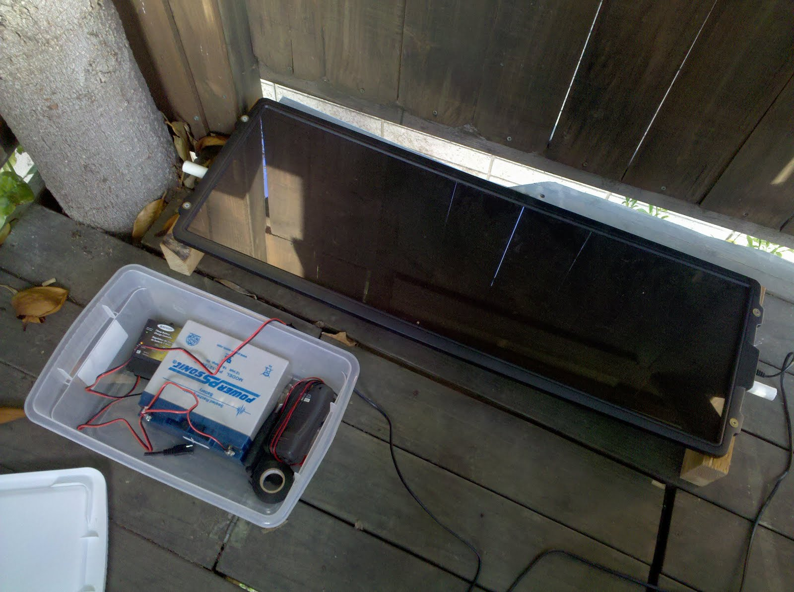
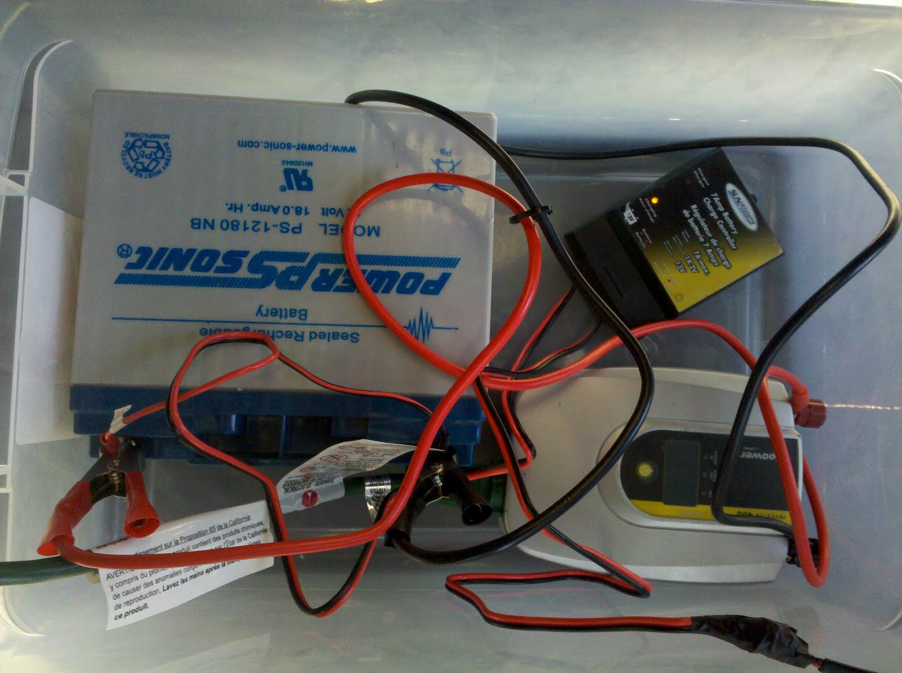

Just finished setting up wiring, can't wait to get it up and running! I wired the SunForce Solar Panel up to the included charge controller. This charges the 18 ah Battery, an equivalent of 216 watt hours or around 3.5 days of charging ("10 watts an hour" * "6 hours a day" = "60 watt hours a day" then "216 watt hours" / "60 watt hours" = "about 3 and 1/2 days"). The battery is wired up to a DC to AC converter that, I hope, will eventually power stuff in my house.

|     |     |
| --- | --- |
|  |  |
