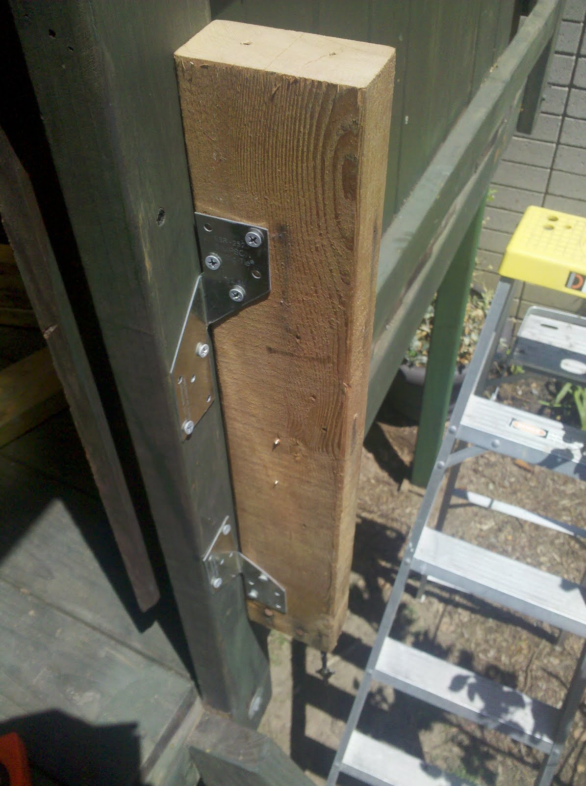

I'm mounting the panel today, it's looking good so far! I've mounted it to my Tree Fort. I've had to add a beam across the front to support the right side of the panel. To keep the panel rotated I've added a strip of plummer's tape (the gray plastic strip on the left side) to the array.

|     |     |     |     |
| --- | --- | --- | --- |
|  |  |  |  |
