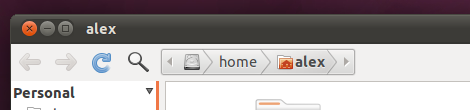

Nautilus Elementary lacked the nice breadcrumb layout when on the default Ambiance theme, so here is a simple fix to bring it to you.

> _**The installation is extremely easy, simply run the following commands in a terminal:**_
>
>     cd ~ #this should take you to your home folder
>     wget http://gnaag.k2city.eu/nautilus-breadcrumbs-hack.tar.gz
>     tar -xvf nautilus-breadcrumbs-hack.tar.gz
> 
> _**Alternatively you can also [manually download it](http://gnaag.k2city.eu/nautilus-breadcrumbs-hack.tar.gz) and extract the contents to your home folder (make sure you copy the contents of the nautilus-breadcrumbs-hack folder directly into your home folder!).**_
>
> _**Then set Nautilus Elementary to use Breadcrumbs by going to Edit > Preferences, on the Tweaks tab enable "Show like breadcrumbs":**_

> ****
> 
> **Finally, you may need to restart Nautilus:**
>
>     nautilus -q
> 
> Source [NAUTILUS ELEMENTARY BREADCRUMBS FOR ANY THEME](http://www.webupd8.org/2010/04/nautilus-elementary-breadcrumbs-for-any.html)

After:

