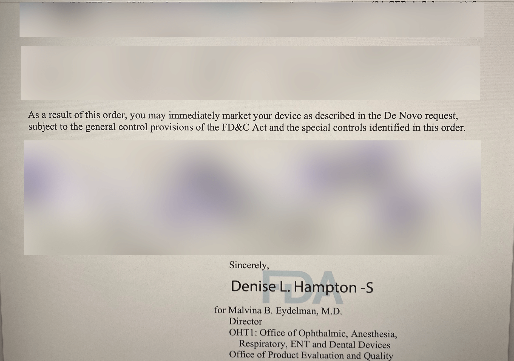

On Wednesday morning I got a call from Scott Xiao, Luminopia's current CEO, letting me know that we'd finally done it: Luminopia had an approved medical device.

5 years ago when we had our first face-to-face with the FDA, Scott had forgotten his Canadian passport so he wasn't even allowed into the building.

Congrats Scott and Dean! What a journey 😊

---

- [Techcrunch - How four-person startup Luminopia is using TV to treat lazy eye ](https://techcrunch.com/2021/10/01/how-four-person-startup-luminopia-is-using-tv-to-treat-lazy-eye/)
- [USA Today - 'Lazy eye' in kids is an age-old problem: A new VR headset brought treatment into the 21st century](https://www.usatoday.com/story/news/health/2021/11/23/fda-approves-new-lazy-eye-treatment-kids-using-virtual-reality/8665017002/)