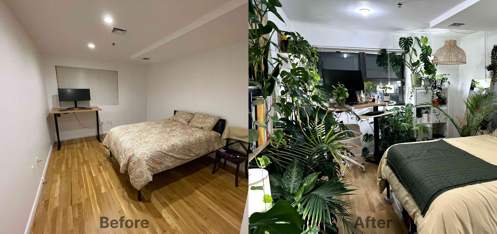
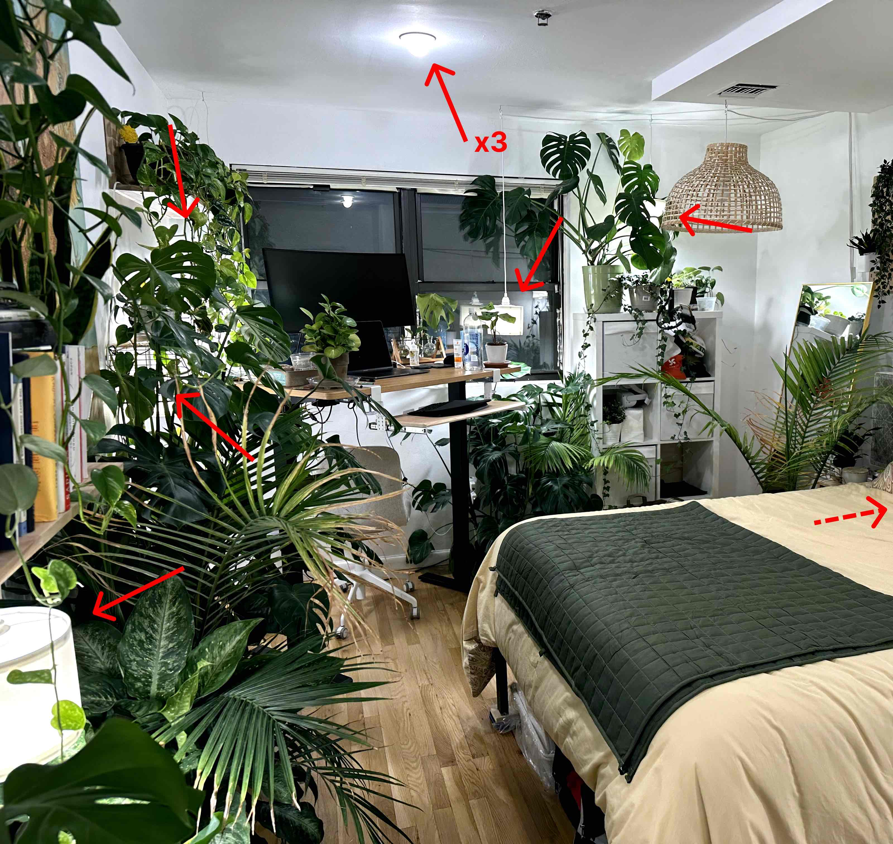
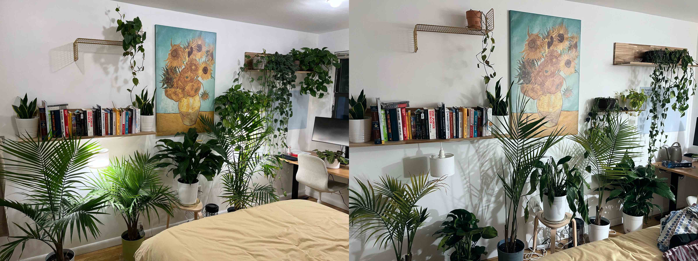
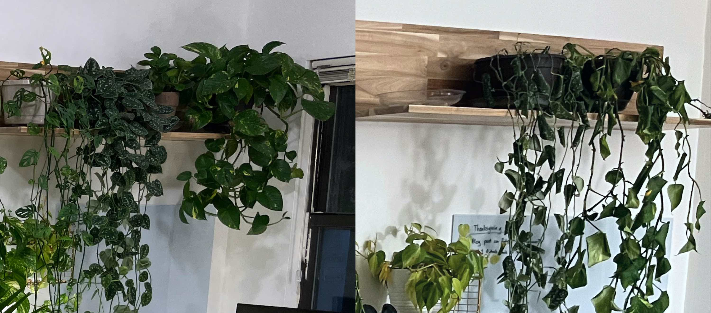
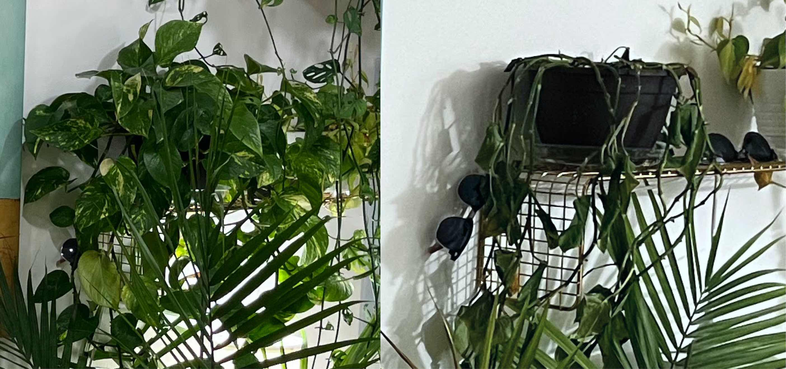

As of December 2022, I've got 34 houseplants[^1] in my 14' x 14' apartment in Manhattan. They take <3 hours of maintenance per month and bring freshness and nature into my life.

I've learned 2 tricks for easy maintenance:

- **Watering trays** - Keep plants in pots that drain into overflow trays. Water them consistently, ~1 per week, with as much water is needed to overflow into the tray.
- **Evergreen plants** - Don't bother picking plants that are impressive, pick plants that are consistently good-enough. A plant that doesn't lose any leaves or flowers and stays green all the time will look better than the orchid you forget to water for 3 weeks.

These tricks are good general advice, but my living situation in Manhattan has brought 3 additional challenges.

### Challenge #1: No Sunlight

**Challenge**: My 2nd-floor room has a north-facing window and is surrounded by 10+ story buildings. I receive ~40 lux of sunlight at 1 pm. Even plants labeled "low light" still require substantial amounts of light to function, between 250 - 1,000 lux ([source](https://gardeningsolutions.ifas.ufl.edu/plants/houseplants/light-for-houseplants.html), 1 ftcd ≈ 11 lux). Compare those levels to [standard indoor spaces](https://www.engineeringtoolbox.com/light-level-rooms-d_708.html): break rooms are around 250 lux and supermarkets are around 750 lux. For comparison, an overcast day is 1,000 lux and full daylight is 10,000 lux.

**Solution**: Replace the 3 overhead bulbs, originally 800 lumens, with 4000 lumen, [high-CRI](https://en.wikipedia.org/wiki/High-CRI_LED_lighting) LED bulbs, and install 6 additional pendant lights. I chose [these](https://www.feit.com/product/4060-lumen-5000k-non-dimmable-led/) from Feit Electric since they fit standard A23 sockets, though they're ~2" taller than a normal bulb. They have a [CRI >80](https://www.feit.com/wp-content/uploads/2019/07/OM300_850_LED_SpecSheet-2.pdf), which, even though [Color Rendition Index isn't as appropriate as Photosynthetically Active Radiation](https://mygardenandgreenhouse.com/lighting/understanding-cri-par-and-ppfd/), still indicates plant-appropriate, and natural looking, lighting. At 5000k, they look like daylight. Most places in my room receie >2000 lux, which makes my room feel more outdoors-like.

Directly under the bulbs can be too bright. See this leaf on a monstera deliciosa which sat ~4" under a pendant light for a few months. Notice the circular discoloration, matching the light's shade, and the browning on the leaf. I now keep plants >12" away from the lights.

### Challenge #2: Limited Space

**Challenge**: I have a 14'x14' bedroom, of which my bed + desk take up ~50% of the space. That leaves just enough room to walk around in and have floor space for ~8 plants.

**Solution**: Shelves. Shelves are amazing, and Ikea has many options that are low cost and easy to mount. I've double-layered shelves on my main wall, providing me with ample space for additional plants (about 24 more). I buy plants that fall into one of two buckets:

- _Floor plants_ - these need to be big, both tall and voluminous, with lots of leaves.
- _Shelf plants_ - these should be viny, with long, leafy vines that drape off the shelf's edge.

### Challenge #3: Travel

**Challenge**: I'm sometimes away from NYC for >4 weeks at a time. My plants usually get watered every 1 or 2 weeks. When I was traveling for the holidays from December 18th, 2021 to January 28th, 2022, many plants suffered:

In particular, look how withered the vines ended up:

**Solution**: In this instance, I was able to recover all of my plants in a few months by aggressively pruning the dead vines and leaves, trimming the plants back to their base. I took cuttings and placed them in water to begin propagating them. Within 3 months the plants had new growth and the propagation were ready to be potted. Within 6 months all the plants were more lush than before.

A key mistake I made on that trip was leaving the lights on. This increases water usage by the plants. For future trips, I leave the lights off to extend the impact of my pre-trip watering. Then, I coordinate with a roommate to water every ~2 weeks while I'm away, which usually means one watering in the middle of my trip. I put all the shelf plants on the ground to make them easier to water.

## Should you get plants?

Yes! They're pretty great. 🪴

<video width="320" muted autoplay loop>
  <source src="peace_lily_being_dramatic.mp4" type="video/mp4">
</video>

[^1]: Catalog of species I have as of December 10th, 2022: 3 dracaena trifasciata (snake plants), 6 monstera deliciosa, 3 epipremnum aureum (golden pothos), 4 philodendron hederaceum, 4 scindapsus pictus (satin pothos), 1 dracaena fragrans (cornstalk dracaena), 2 pilea peperomioides (chinese money plant), 3 ravenea rivularis (majesty palm), 1 dieffenbachia (dumb cane), + 8 more I'm forgetting the names of.
