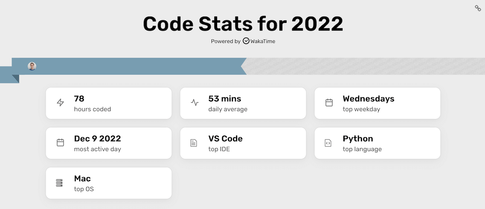
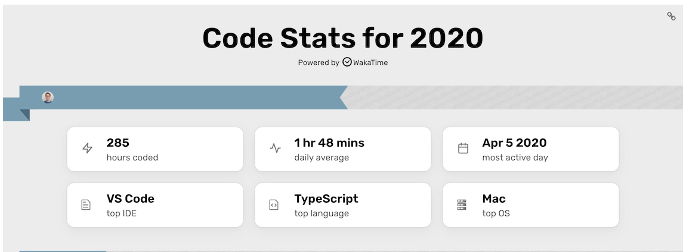

I use a program called Wakatime to track my IDE usage. In 2021, I was in the top 10% of all users. In 2022, I decreased substantially, matching my career transition from software engineering to product management.

## I spent 120 hours actively using an IDE in 2022

I was pleasantly surprised to see only 6 hours of software engineering work for Pinwheel. As I was transitioning into being a PM full-time, I had two concerns: being unable to pull away from development work and staying too in-the-weeds with the engineering team. I've had qualitative feedback that I avoided the latter issue, and I'm happy about this quantitative data showing I've avoided the former! This was ~1/100th of the time I spent programming for Pinwheel in 2021. Instead, I spent hundreds of hours[^2] using writing and data analysis tools (Notion, Jupyter notebooks, Google Sheets, Looker, and various SQL runners).

The remaining ~100 hours were between consulting work for Luminopia and friends' startups, and hobby projects. I've been working on improving my productivity, so I was glad to see my hobby project work in <3 hour bursts. More than 70% of the bursts corresponded with discrete functionality being added[^3]. These were spread across 5 projects, 2 of which were 3+ years old, demonstrating maintainability.

## Next 3 years

I've had a personal theme of "pace" over the past 3 years: how can I be more efficient with the time I spend? I.e., getting to the 80% quality bar as quickly as possible, and only going to >95% quality when absolutely necessary.

I plan on keeping this theme for the next 3 years. I'm applying it to more than programming. With programming though, it means less fun going down meandering technical rabbit holes, but delivering more projects that actually achieve their goals! *Now to stop yak-shaving my offline file indexer and ship a working version...*

- - -

Wakatime stats for 2020, 2021, and 2022. 2022 is missing ~40 hours of work that I performed in Gitpod.io, a cloud dev environment.

[^2]: In addition to Wakatime I use Rescuetime. Wakatime tracks IDE usage, which repo you're working on, and the languages of the files you're editing. Rescuetime tracks which desktop apps and websites you're actively using.

\[^3]: Based on a quick review of the past 2 months. I coded on 26 days, grossing an average of 1.5 hours per day. According to the commit log, I released a workable feature on most coding days.