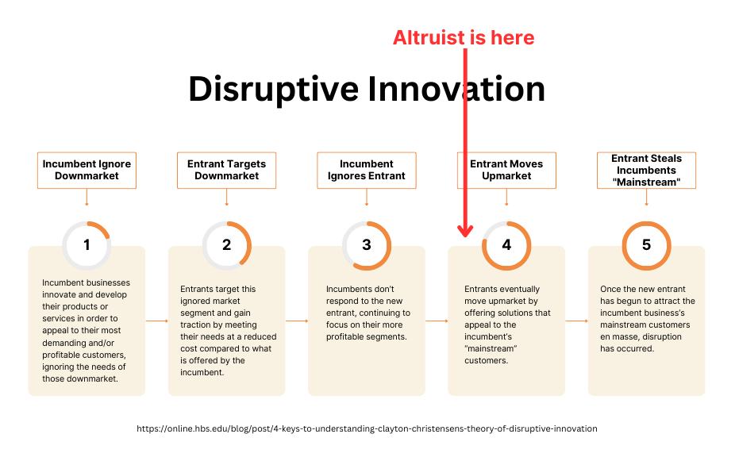

**Summary**

Altruist’s[^a] bundled custodian + platform software model presents an existential threat to Schwab & Fidelity’s ~$5T AUM hold on the independent RIA market. Altruist is making a classic disruption play, and, as of April 2023, they’re on the brink of stage 4 of the [Disruptive Innovation process](https://online.hbs.edu/blog/post/4-keys-to-understanding-clayton-christensens-theory-of-disruptive-innovation). Schwab & Fidelity need to address their downmarket gaps ASAP. Their best bet may be to acquire [Advyzon](https://www.advyzon.com/main/index.html).

**Stage 1 - The Setup, "Incumbent Ignores Downmarket"**

Non-institutional financial advisors manage $7.5T of client assets[^b]. The vast majority of these assets are custodied at Charles Schwab and Fidelity, who have been serving independent RIAs for several decades.

Over the past 20 years, software platforms emerged on top of Schwab and Fidelity to offer better portfolio management. These tools, like Envestnet[^c], Orion[^d], AssetMark[^e], InvestCloud[^f], now have an enterprise value of ~$10B.

Schwab & Fidelity's custodial services are free since they monetize custodied assets with payment for order flow, securities lending, and interest on cash holdings[^g]. However, the software platforms and their automated portfolio management models cost money. Sometimes the custodians offset these software platform fees, usually for >$5B AUM RIAs.

Both the custodians and most software platforms are primarily focused on >$1B AUM RIAs.

Small custodians, <$1B in AUM, didn't have great software platform options. Moreover, they had to pay for their software, it's rarely offset by the custodian.

**Stage 2 - The New Entrant, "Entrant Targets Downmarket"**

Altruist verticalized these businesses[^h], offering custodial services and a modern software platform for free. How? They monetize entirely on custodial income, which is around 40-70 bps of AUM. From this lens, the platform software acts as a low-cost customer acquisition + retention mechanism.

Altruist initially focused on small, <$50M RIAs, quickly surpassing other downmarket players. Altruist charged these small advisors nothing, which, given Altruist's 200-engineer headcount, required massive capital burn---they've raised $290M since they were founded in 2018[^a].

**Stage 3 - The Power Base, "Incumbent Ignores Entrant"**

Neither Schwab nor Fidelity has invested in the software platforms that small RIAs use.

Instead, Schwab acquired TD Ameritrade. If Altruist wasn't around, this would have been great for Schwab, it expands their coverage to downmarket advisors---where TD Ameritrade had a strong presence. However, the acquisition is forcing advisors to "repaper" their clients, i.e., requiring them to sign forms switching their custodian from TD Ameritrade to Schwab. Many advisors are taking this opportunity to evaluate the custodial market---an action that they'd normally rarely do since what they have is good enough---and their focus is landing on Altruist. While Schwab's been distracted with the TD Ameritrade merger, Altruist has been sweeping up the downmarket, adding ~1,500 RIAs in the past 3 years.

These small RIAs love Altruist[^j].

**Stage 4 - The Attack, "Entrant Moves Upmarket"**

Altruist has several advantages over the incumbents:

-   They're verticalized, so they have better gross margin.
-   They're new, so they have software with higher user satisfaction ratings[^j].

Altruist also strengthened it's offering [by acquiring SSG](https://www.wealthmanagement.com/technology/altruist-acquires-ria-custodial-platform-shareholders-service-group). SSG provides two things, a best-in-class customer service team, and a relationship with Pershing allowing Altruist to support option and margin accounts[^k]. For most advisors, Altruist's custodial services are now on par with Schwab & Fidelity's offerings.

Altruist is well positioned to move upmarket. Its lower gross margin lets it offer better pricing than incumbents[^l]. Its better software gets prospective users excited, turning them into [product champions](https://aws.amazon.com/blogs/startups/finding-your-internal-champion-startup-founder-sales-series-part-9/)[^j].

Altruist is moving upmarket.

Schwab and Fidelity can't wait for Altruist to gain a foothold upmarket---$1B to $100B RIAs---where Schwab and Fidelity make most of their money. They need to address the gaps downmarket that allowed Altruist to flourish.

**What now?**

*Are Schwab and Fidelity going to build their way out of this by creating competitive platform software in house?*

No. The existence of incumbent platform software providers demonstrates that Schwab and Fidelity aren't good at this. They aren't structured like a high-caliber software development organization. They can't match Altruist's agility.

*Could Schwab and Fidelity partner more closely with Envestnet, Orion, InvestCloud, AssetMark, or the other major players to offer user-friendly software and reduce their costs to be price competitive with Altruist?*

Unlikely. These incumbent platforms are dealing with their own software development challenges. Their platforms are amalgamations of dozens of acquisitions over the past 20 years, leading to fragmented product experiences. The public ones have operating margins that are low or negative.

*Could Schwab and Fidelity buy Altruist?*

Unlikely. Jason Wenk stated that the ["$112M Series D [was] to take on Schwab and Fidelity"](https://www.businesswire.com/news/home/20230412005541/en/Altruist-raises-112M-Series-D-to-take-on-Schwab-and-Fidelity-in-128-trillion-RIA-market) in all their PR announcements. He's shooting for the moon.

*Is there a smaller player Schwab and Fidelity could buy to compete directly in the downmarket?*

Possibly. The [2023 T3/Inside Information Advisor Software Survey](https://t3technologyhub.com/wp-content/uploads/2023/03/2023-T3-and-Inside-Information-Software-Survey.pdf) calls out [Advzon](https://www.advyzon.com/) as a "Software Allstar". It's the only platform to consistently receive higher user satisfaction ratings than Altruist. Founded in 2012, they have a cloud-first tech stack unlike the incumbents.

Advyzon is probably acquirable for <$60M. Why? Advyzon claims ~1,200 customers. A reasonable estimate for Advyzon's average contract size per customer is $10,000 / year[^m], resulting in $12 million of annual revenue. Advyzon's CAGR is ~10%[^n], placing them in a [startup valuation bucket of 1-5x revenue](https://web.archive.org/web/20230208203015/https://microcap.co/startup-valuation-revenue-multiple/). Outside investors would probably value them at <$60M.

**Schwab or Fidelity could acquire Advyzon, forgo the $12M in revenue Advyzon generates each year, and offer Advyzon for free to advisors.**

**Match Altruist toe-to-toe.**

[^a]: [altruist.com](https://altruist.com/). "The only modern custodian built exclusively for RIAs." [Founded in 2018](https://www.crunchbase.com/organization/altruist-corp). [Raised $290M](https://grow.altruist.com/announcing-112m-series-d). [Serving ~1700 RIAs as of May 2023](https://web.archive.org/web/20230509212149/https://altruist.com/altruist-vs-legacy-custodians/).

[^b]: Based on an analysis of Form ADVs from April 2023. I took the sum of 5F(2)(c), i.e., discretionary + non-discretionary AUM, for all RIAs who said "Yes" to 5G(1), i.e., they perform financial planning functions, who have less than $100B in AUM.

[^c]: [envestnet.com](http://envestnet.com). [Founded in 1999. Employs ~3,400 people. Publicly valued at $3B.](https://www.google.com/finance/quote/ENV:NYSE?sa=X&ved=2ahUKEwiNppKCh_v-AhXpD1kFHVyjBosQ3ecFegQIOxAY)

[^d]: [orion.com](http://orion.com). [Founded in 1999. Employs ~1,500 people.](https://pitchbook.com/profiles/company/107982-55) [Privately valued at ~$2B](https://orion.com/advisor-tech).

[^e]: [assetmark.com](http://assetmark.com). [Founded in 1996. Employs ~1,000 people. Publicly valued at $2B.](https://www.google.com/finance/quote/AMK:NYSE)

[^f]: [investcloud.com](http://investcloud.com). [Founded in 2010](https://www.linkedin.com/in/johnwise2/), [then merged in 2021 with Finantix and Tegra118](https://riabiz.com/a/2021/2/12/investcloud-long-tagged-an-envestnet-killer-sold-at-1-billion-valuation-level-gets-added-to-tegra118-but-some-say-not-so-fast), [which was a spinout from Fiserv in 2020](https://www.wealthmanagement.com/technology/motive-partners-closes-fiserv-deal).

[^g]: [Schwab's 10-K](https://content.schwab.com/web/retail/public/about-schwab/SEC_Form10k_2022.pdf). See page 35 for a breakdown of revenue, and 35-41 for a walkthrough of the revenue sources. Page 83 provides further non-GAAP breakdown of these sources. See this Kitces article, [How 'Free' RIA Custodians Make It Difficult To Determine Which Is Actually The Most Expensive](https://www.kitces.com/blog/yang-xu-tradingfront-ria-custodian-commission-free-trading-net-interest-margin-income-cash-sweep-bank/), from 2020 for a detailed overview of custodian revenue generation.

[^h]: [Altruist transitioned from using Apex Clearing to being their own, self-clearing custodian](https://grow.altruist.com/the-next-chapter-of-altruist). [Before this transition, Apex was sharing custodial revenues with Altruist](https://news.altruist.com/altruist-joins-forces-with-apex-clearing-to-offer-advisors-frictionless-investing-experience). Now, Altruist makes those directly, keeping more margin for itself.

[^j]: Altruist has an "extraordinary (8.0+) average user rating" in most of the categories it competes in on the [2023 T3/Inside Information Advisor Software Survey](https://t3technologyhub.com/wp-content/uploads/2023/03/2023-T3-and-Inside-Information-Software-Survey.pdf). Incumbents like Envestnet and Orion are around 7.0 in most categories on the survey.

[^k]: Altruist is likely working towards building support for custodying these asset types themselves in house. However, the TD Ameritrade → Schwab transition offers a critical window when RIAs are shopping around for a new custodian, and Altruist needs to be able to check every box on their procurement checklist.

[^l]: How does Altruist undercut incumbent pricing, when custodians are already offsetting the cost of platform software for upmarket RIAs? In addition to platform software fees, RIAs also pay third party software providers for portfolio management models (or they pass these fees through to clients, effectively increasing the client's perceived cost of the RIA). These models provide functionality like direct indexing, tax loss harvesting, blocklist/allowlists, rebalancing, sector weighting, [factors](https://www.investopedia.com/terms/f/factor-investing.asp), etc. For incumbents, these fees can range from 30-150 bps. For example, see [Envestnet's March 2023 Form ADV Part 2](https://web.archive.org/web/20230304063909/https://www.envestnet.com/sites/default/files/2022-12/EAM-ADV-Part2A-Appendix.pdf). Altruist charges <15 bps for most of it's models---see the [Altruist model marketplace fee schedule for May 2023](https://web.archive.org/web/20230518204608/https://altruist.com/m/Altruist-LLC-Fee-Schedule-2023.05.15.pdf). How? It offsets the cost of the models by sharing custodial revenue with model providers.

[^m]: $10,000 per year per customer is a generous average based on publicly available data and reasonable assumptions. Advyzon charges ~$25 per account per year, with a minimum contract size of ~$6,000, according to a [2019 article on T3 Technology Hub](https://web.archive.org/web/20230208133835/https://t3technologyhub.com/advyzon-ups-its-game-an-underappreciated-compelling-value-in-a-crowded-field/). These numbers match what I've heard from conversations with RIAs in April 2023. ~9% of Advyzon's customers have >$100M in AUM as of 2021, based on their [flat-fee report](https://web.archive.org/web/20230518221250/https://engage.advyzon.com/hubfs/Advyzon%20White%20Paper%20Whats%20Fee-sible%3F.pdf) (they report 26% of all customers use flat fees; segmenting into 36% and 25% for >$100M firms and <$100M firms respectively; solving for 26% average = x * 36% + (1-x) * 25% ⇒ [x = 9%](https://www.wolframalpha.com/input?i=26%3D%28x%29*36%2B%281-x%29*25)). Fidelity reports $1.5M as the average client AUM for <$1B advisors in [their 2023 benchmark survey](https://web.archive.org/web/20230518222221/https://clearingcustody.fidelity.com/app/proxy/content?literatureURL=/9907134.PDF). Assuming that all 9% of Advyzon's >$100M clients actually have $1B in assets, or ~700 clients, would generate contract sizes of $17,500. Averaging $6,000 for 91% of clients and $17,500 for 9% of clients results in a ~$7,000 average customer contract.

[^n]: [In 2021 Advyzon passed 1,000 customers. In 2023, Advyzon claimed 1,200 customers.](https://web.archive.org/web/20230518232359/https://www.advyzon.com/main/index.html) This is a compounded annual growth rate of [9.5%](https://www.wolframalpha.com/input?i=%28%28%281200%2F1000%29%5E%281%2F2%29%29-1%29*100).