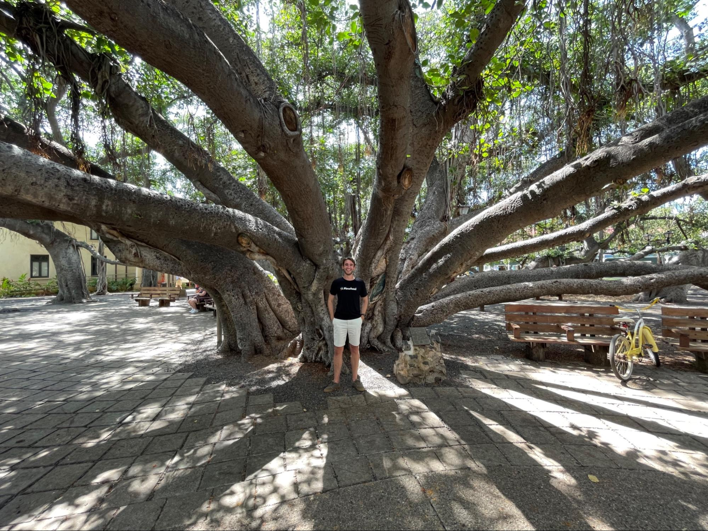
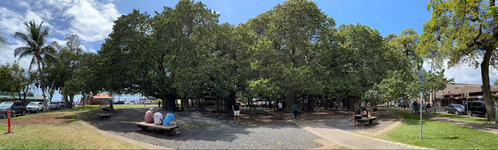
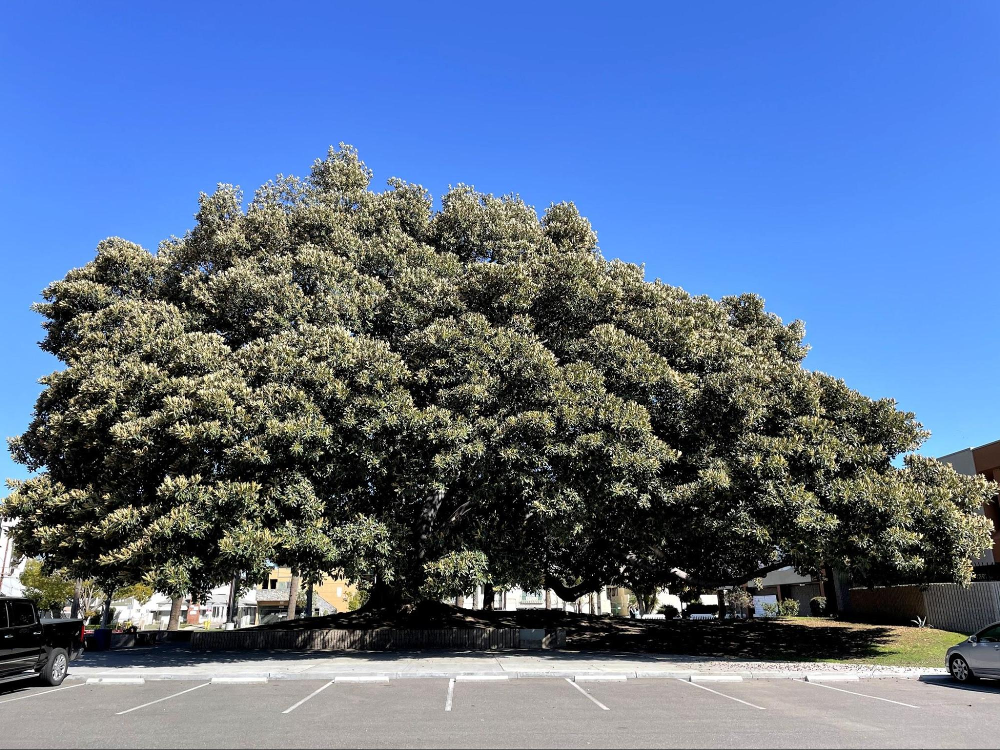
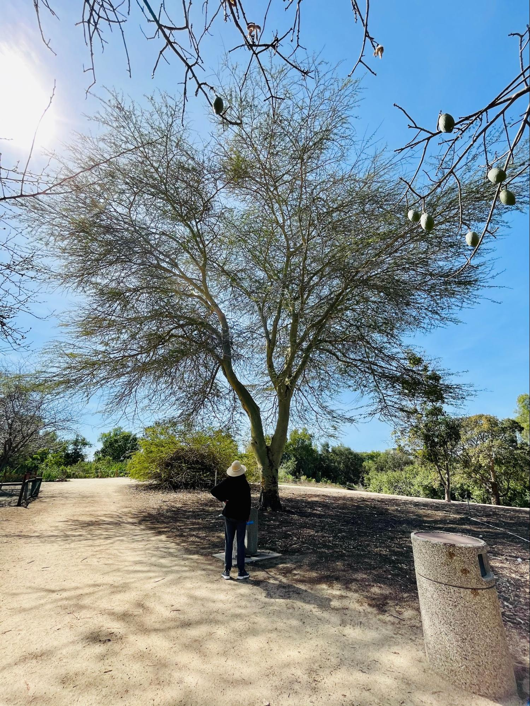
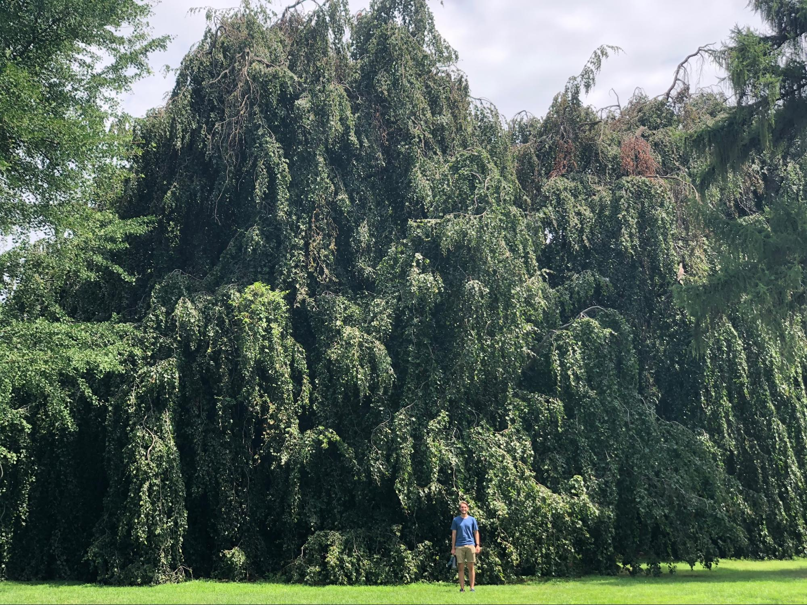
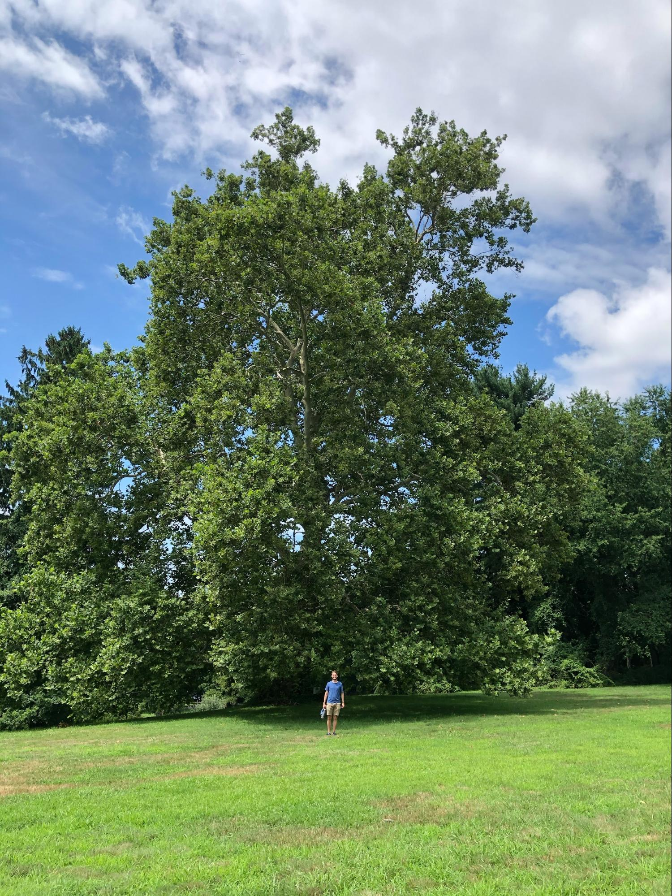
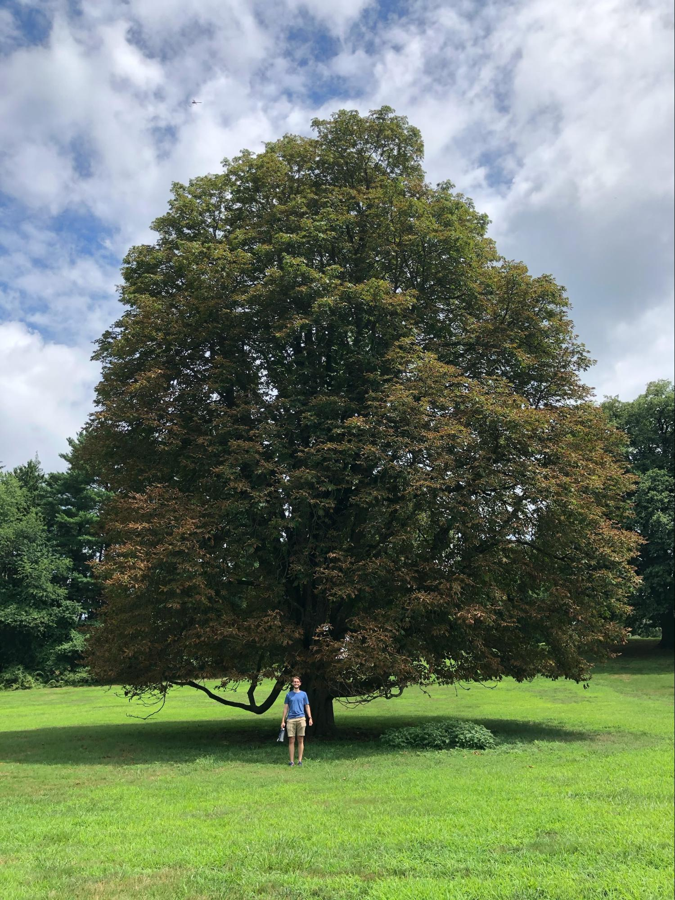

Other great big tree websites: [Gathering Growth Foundation](https://www.google.com/url?q=https://www.gatheringgrowth.org/champion-trees&sa=D&source=editors&ust=1705382884188700&usg=AOvVaw37iqn%5FinYwTvMJD9ywiQ-T)

### Maui, HI - April 21, 2021

Lahaina Banyan Court.

The largest ficus benghalensis in the USA and has its own [Wikipedia page](https://www.google.com/url?q=https://en.wikipedia.org/wiki/Banyan%5Ftree%5Fin%5FLahaina&sa=D&source=editors&ust=1705382884189500&usg=AOvVaw00UE-%5FPK1W-nTfMtIafUb4). Planted in April of 1873 (148 years before this photo). It’s grown to have 16 major trunks, each of which looks like it’s own tree until you notice the connecting limbs coming from the central trunk. GPS (20.886111, 156.674722).

### Santa Ana, CA - March 9, 2021

Willard Intermediate School.

Possibly a magnolia grandiflora based on [Cal Poly’s SelecTree tool](https://www.google.com/url?q=https://selectree.calpoly.edu/tree-detail/magnolia-grandiflora&sa=D&source=editors&ust=1705382884190279&usg=AOvVaw3evQ02xV6C-oCgPFUSgvDi). The school was [opened in 1973](https://www.google.com/url?q=https://ochistorical.blogspot.com/2020/03/willard-intermediate-school-santa-ana.html&sa=D&source=editors&ust=1705382884190576&usg=AOvVaw0U0SpHvMcMTqxgM0JGmCLo), and based on the tree’s size it may be the same age if not older. GPS (33.757125, -117.873171).

### Irvine, CA - February 28, 2021

San Joaquin Marsh, the headquarters of the Irvine Ranch Water District.

Maybe a vachellia farnesiana since “the base of each leaf is accompanied by a pair of thorns on the branch”, however this tree was quite tall and likely at the upper end of the height range. GPS (33.6671059, -117.8373167).

### Lyndhurst, NY - July 31, 2020

Massive, leafy, robust trees at Lyndhurst Mansion in New York. Requires tickets to access the property.

