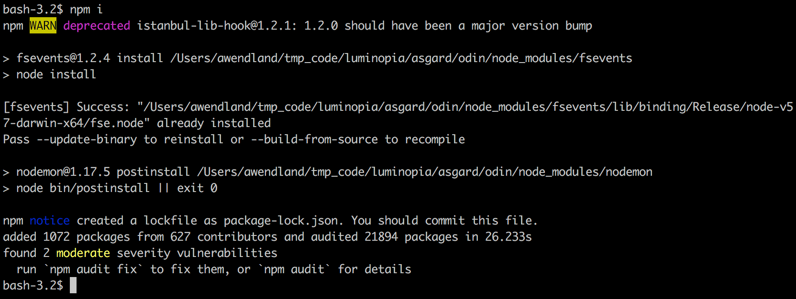

With NPM's recent [acquisition of ^Lift Security and the Node Security Platform](https://medium.com/npm-inc/npm-acquires-lift-security-258e257ef639), as well as the release of their [package-lock.json](https://blog.npmjs.org/post/161081169345/v500) and the [`npm ci` command](https://blog.npmjs.org/post/171556855892/introducing-npm-ci-for-faster-more-reliable) for reliable CI installations, it seemed like a compelling time to reavaluate the value proposition of [Yarn](https://yarnpkg.com). Plus, for some reason Yarn kept giving me 401s on our CI two weekends ago for some unknown reason, so it made me think about NPM for the first time in a long time, and I got curious what the state-of-the-world is.

Spoiler: I'm going to be trying out `npm` for projects moving forward.<!--break-->

_This post was edited on Nov. 4th, 2018. You can find the previous version at [archive.org](https://web.archive.org/web/20181104211429/https://blog.alexwendland.com/2018/yarn-vs-npm/)._

## Backstory

Just jump to [Comparison](#comparison) if you aren't interested in some brief rambling.

### My Biases

I like to keep the number of packages I have to a minimum, and similarly I like to keep the number of install steps to as few as possible. NPM has come bundled with Node since around 2013 (don't cite me on that, but it's rougly correct), while Yarn is a separate entity (though it's been included in the Node Docker image [for quite some time](https://github.com/nodejs/docker-node/commit/a86d32ab9a687de2c68cdcc4aafcd9d27e96106a)). As a result, I'd like to just rely upon NPM if possible, because they're doing all the package hosting, and I prefer to as few entities as possible for tools/services.

### Why Yarn?

Quick back story to why I ever used Yarn.

First off, if you looked at that link for the Yarn inclusion in the Node Docker image above, you'd see that Yarn was added in very early on in it's release. Clearly, Yarn was solving a real problem in the node package community—a problem that every JavaScript team I've been on has felt. In some ways it's frustrating that NPM has taken so long to address the issues that Yarn resolved, but many of those concerns are in the past.

Now we can expect:

- Locked package versions, not just top-level packages, but all packages + dependents, in a project.
- Caching of packages so that long network interactions aren't required for every install.

It doesn't sound like much, but the first feature is critical when you want to ensure the reproducibility and reliability of your application.

## Comparison

I'm taking a look at a couple things for each package manager:

- Ease of use (as subjectively judged by me)
- Speed (tested against my projects)
- Extra bells and whistles (that interest me for my use cases)

You'll notice a lot of me's and my's in there, that's because this comparison is primarily for an audience of me, and secondarily for an audience of anyone with similar needs. I'm not trying to make claims about one being better than the other in every situation, and I would expect a reasonable person to disagree with my outcome. With that aside, here're some comparisons:

### Ease of use

Three major pain points w/ NPM on this one:

<!-- markdownlint-disable MD029 -->

1. It yells at you with a paragraph of text every time an `npm run $SCRIPT` exits with a non-zero error. This sucks and is a pain. I've set `alias npm 'npm -s'` (`-s` enables silent mode) to shut it up.

2. You have to prefix all scripts with `npm run` instead of just `yarn`, and if you want to pass arguments to the underlying script you have to use `npm run $SCRIPT -- $ARGS` instead of `yarn $SCRIPT $ARGS`. These are minor annoyances, but after getting used to how lenient Yarn is here, it's a bit annoying to switch back.

3. The `npm install` output is uglier than Yarn's. Yarn is informative, condensed, easy to follow, and polished. NPM looks messy, makes it hard to understand things, and is even worse when not in a TTY.

_Yarn installing things in a beautiful manner_

_NPM vomiting out information_

4. NPM reformats your `package.json`. Personally, I like to put blank lines around scripts in the `package.json` to group things together visually, but unfortunately, running `npm i` will edit your `package.json` and remove them, even if it makes no other change.
<!-- markdownlint-restore -->

So, my initial claims of using NPM moving forward are not based on it's superior ease-of-use, sadly.

### Speed

This was one of Yarn's biggest claims when it first came out, drastically better performance than NPM. However, NPM's been hard at work on this, and with the package-lock.json as well as new approaches to dependencies fetching, things seem to be improving.

Several recent blogs compared the installation performance of the two, and Yarn came out on top.

- [https://blog.scottlogic.com/2017/06/06/does-npm5-deprecate-yarn.html](https://blog.scottlogic.com/2017/06/06/does-npm5-deprecate-yarn.html)
- [https://gist.github.com/slavafomin/00861f9c9f60a4d56ac86680c800b7be](https://gist.github.com/slavafomin/00861f9c9f60a4d56ac86680c800b7be)

However, I was curious how it would perform for my projects, so I ran it through it's paces on an app with around 2400 dependencies (oh me oh my).

#### Methodology

I'm executing `npm i` vs. `yarn` in a project with around 2400 dependencies (with about 100 of those being top level, installing to around 945 MB). This is running several additional hooks, so the actual installation portion of the timing, which I expect to be the only part impacted by yarn vs npm, will be only a fraction of the reported time. I may re-execute without those hooks later, if the initial benchmark proves useless. I will wipe the node_modules and yarn/npm cache before each run. I'll execute each install several times.

#### Results

- NPM (6.1.0)
  1. `time npm i` = 56.38 real 81.60 user 69.47 sys (2018-06-05 9:00 PT)
  2. `time npm i` = 56.68 real 71.83 user 65.46 sys (2018-06-05 9:00 PT)
- Yarn (1.3.2)
  1. `time yarn` = 101.71 real 97.16 user 114.96 sys (This warning popped up for a brief second "_warning There appears to be trouble with our server. Retrying..._") (2018-06-05 9:05 PT)
  2. `time yarn` = 134.81 real 98.24 user 117.22 sys (2018-06-05 9:05 PT)
  3. `time yarn` _w/o clearing cache_ - 64.50 real 64.97 user 87.20 sys (2018-06-05 9:10 PT)

The error outputs for the non-install hooks appeared to be the same for each tool. However, npm informed me about several package vulnerabilities during the install process, and recommended running `npm audit` to learn more.

Before each yarn test I renamed `/Users/$USER/Library/Caches/Yarn/v1` (the output of `yarn cache dir`) to a separate folder to effectively wipe the cache (but letting me get it back later).

### Bells and Whistles

Both package managers bring some extra features to the table.

**Yarn** provides `yarn licenses ls` which I've leveraged in a pre-commit script to ensure that every package to the project has an acceptable license for our commercial use case. NPM doesn't have an equivalent, but there are several packages that provide this functionality (loosely ranked by my first-glance impression of their READMEs):

- [https://www.npmjs.com/package/license-checker](https://www.npmjs.com/package/license-checker)
- [https://www.npmjs.com/package/nlf](https://www.npmjs.com/package/nlf)
- [https://www.npmjs.com/package/licenses](https://www.npmjs.com/package/licenses)

**NPM** provides the new [`npm audit` and `npm audit fix`](https://docs.npmjs.com/cli/audit) commands for detecting and correcting known security vulnerabilities in your dependencies. It uses [nodesecurity.io](https://nodesecurity.io/advisories)'s collection of security reports to perform this functionality. To run, this requires a `package-lock.json` file, so it can't be used with Yarn AFAIK (you don't want a `yarn.lock` and `package-lock.json` at the same time because they won't be in sync, each package manager may resolve dependencies differently). You can read more about the release of this feature on the [npm v6 announcement](https://medium.com/npm-inc/announcing-npm-6-5d0b1799a905).

### Other References

Other people have treaded these waters comparing the two before me, here were some additional blogs I read while reviewing things:

- [https://blog.risingstack.com/yarn-vs-npm-node-js-package-managers/](https://blog.risingstack.com/yarn-vs-npm-node-js-package-managers/)
- [https://www.keycdn.com/blog/npm-vs-yarn/](https://www.keycdn.com/blog/npm-vs-yarn/)

## Outcomes

I switched over to **NPM**.

- It is integrated w/ npm audit.
- It is the first-party tool of the node package library.
- It's faster (shockingly) than Yarn (in initial install scenarios w/ no cache to use).

All of this comes with two big caveats:

1. These were the results given my specific project, NPM may be slower in other instances.
2. I haven't yet dealt with NPM enough to know how bad the ease-of-use stuff really is. Maybe a week from now I'll be tearing my hair out and post an update complaining about it to no end.
   - Update 2018-11-04: I miss Yarn's better UX. It would be nice if the NPM team would make improvements in this realm.
