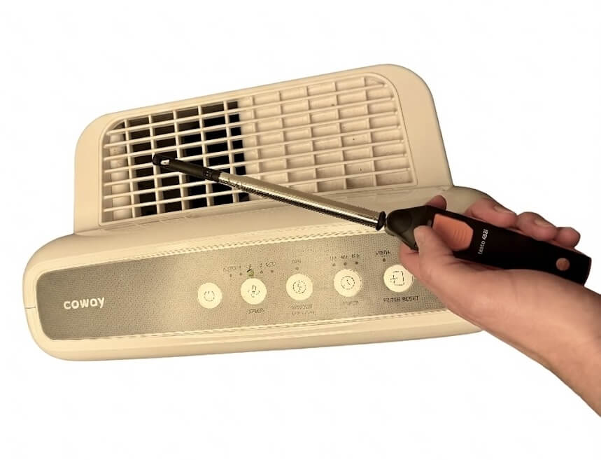
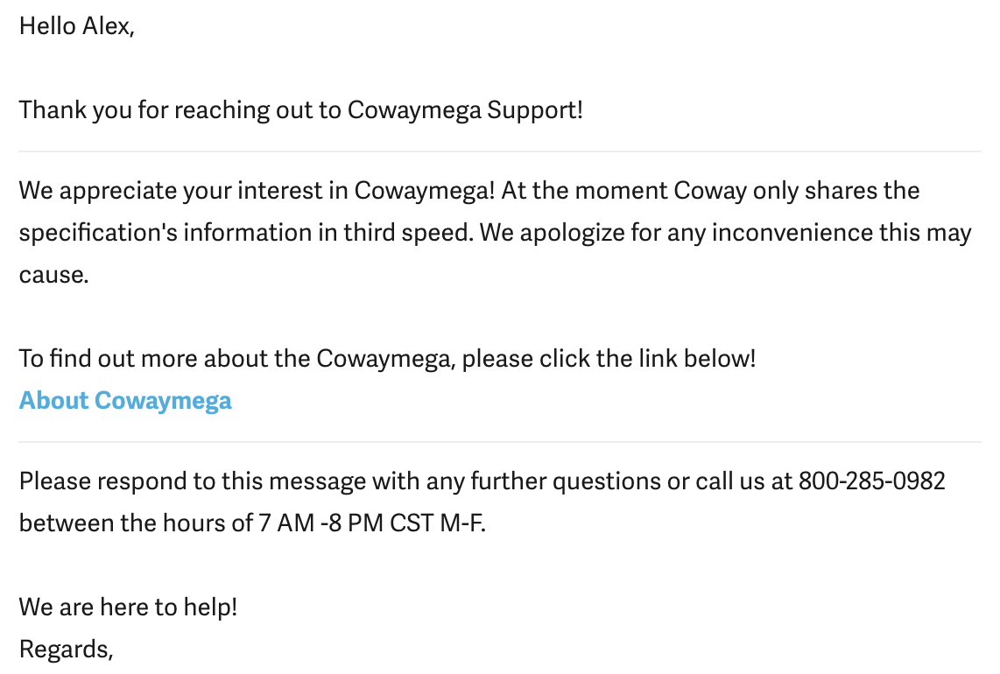

Tl;dr: [Coway's Airmega 200M](https://cowaymega.com/products/airmega-200m) has a CFM of ~100 CFM on speed 2 vs. ~250 CFM on speed 3.

I measured the return air output on 2nd speed at several locations for a cumulative 40 seconds using a Testo 405i hot-wire anemometer and got a flow velocity of 1,139 FPM over a surface of 3.5 in x 5.0 in, resulting in a 138 CFM. However, when I measured speed 3 I got a reading around ~330 CFM, so my readings are inflated. Overall, speed 2 has a disappointing CFM and I'm going to swap to [Luggables by CleanAirKits](https://www.cleanairkits.com/products/luggables) which my measurements say is 340 CFM for Luggables 5 Mobius 2400rpm (smallest size) and runs at a volume level equivalent to speed 1 on the Coway Airmega 200M.

Coway won't tell you what the CFM is on the 2nd speed setting. This information is important because the 3rd speed setting, which they report, is extremely loud and unreasonable to run normally.

